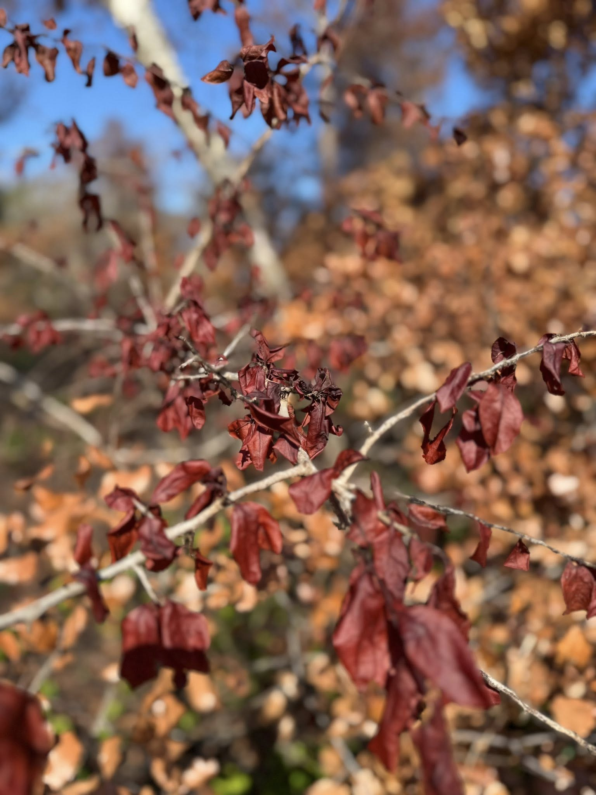

# Ashes and Embergrass

Recently, I visited a Florida state park that had sustained a wildfire. Walking through the charred trails and seeing nature quietly rebuilding itself was both heartbreaking and beautiful. That moment inspired the story below—a reflection on hardship, healing, and the strength we find in starting over.

The idea came from my own experience, and I used ChatGPT to help me shape and polish the writing. If you're ready for a little longer read, I hope it resonates with you as much as the park did for me.

---

## The Story

The fire began with a flick—  
careless, thoughtless, a cigarette dropped by someone who thought the world too small to burn.

The dry grass caught fast.  
Saw palmetto, pine needles, and the breeze off the gulf turned hush into howl.  
Flames licked up trunks like tongues of fury, and the sky darkened with smoke and regret.  
Animals fled. Palm fronds sizzled.  
The sandy trails turned to soot.

*Charred trail through the park after the wildfire*

The fire raged for hours, then days.  
What once was a quiet beachside grove became a graveyard of blackened stumps and scorched silence.

*Fallen trees*

But endings lie.

*Fire birthed beauty*

Days later, the rains came—not heavy, just soft and steady, as if the sky felt sorry.  
They cooled the land. Let the ash settle. Gave the ground a chance to breathe.

And within a week—green.

*Later—regrowth in progress*

Shoots.  
Bright. Bold. Defiant.  
Embergrass pushing through char.  
New life rooted in loss.  
A reminder: even after fire, we grow back stronger.

---

**Thanks for reading.**  
The story was born from a real place, shaped by emotion, and refined with the help of ChatGPT.  
Scroll through the photos that inspired it—and maybe you’ll see the rebirth too.
